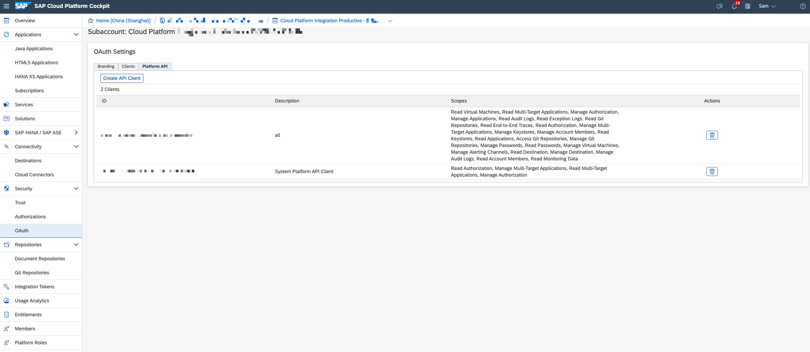
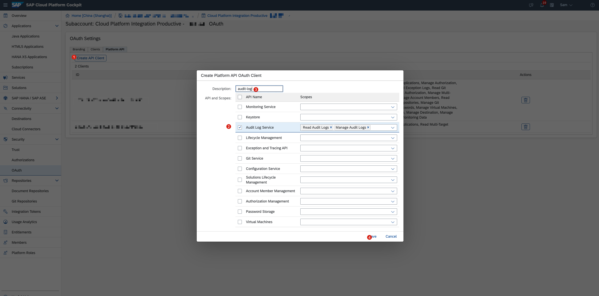
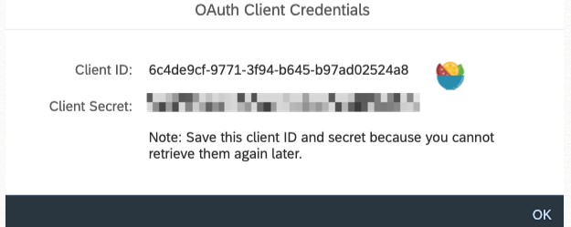
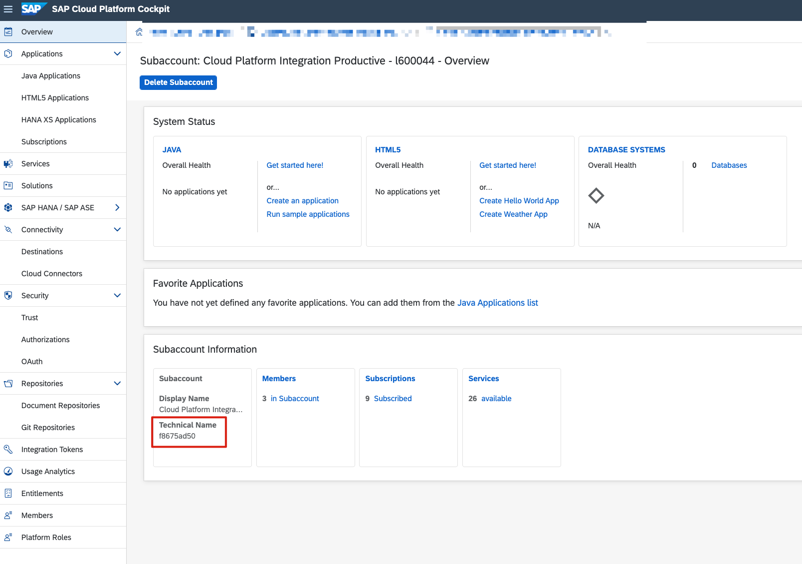

<!-- TOC -->

- [通过Audit API 查询系统登录日志](#通过audit-api-查询系统登录日志)
  - [1 设置Platform API客户端](#1-设置platform-api客户端)
  - [2 获取Bearer Token](#2-获取bearer-token)
  - [3 访问api获取日志信息](#3-访问api获取日志信息)
- [参考文档](#参考文档)

<!-- /TOC -->

## 通过Audit API 查询系统登录日志
### 1 设置Platform API客户端
进入Cockpit，选择子账户，选择Security, OAuth.

点击选择Platform API,新建 API Client, 勾选Audit Log Service。

保存结束之后会有一个弹框，里面包含Client ID和Client Secret。注意很重要要保存好。

### 2 获取Bearer Token
使用Postman通过API方式获取Bearer Token。

1.url: https://api.\<SAP Cloud Platform host\>/oauth2/apitoken/v1?grant_type=client_credentials。根据自己的所在data center去填写具体的DC。  
举例： https://api.cn1.hana.ondemand.com/oauth2/apitoken/v1?grant_type=client_credentials  
2. Authroization Type是Basic Auth
3. Username和Password对应上面获取Client ID和Client Secret。

点击Post,获取到Bearer Token, Access_token。这个Access_Token注意保留下一步有用。

### 3 访问api获取日志信息
Postman另外开一个窗口，获取Audit Log信息。

1. url, https://api.\<SAP Cloud Platform host\>/auditlog/v1/accounts/\<account\>/AuditLogRecords?$count=true   
这里的f8675ad50是这个subaccount technical Name.

举例:https://api.cn1.hana.ondemand.com/auditlog/v1/accounts/f8675ad50/AuditLogRecords?$count=true,

2. Authorization Type选择Bearer Token，填上由上一步获取的access_token

3. 使用Get方法获取

最后可以在Body部分看到所有的Audit Logs。

## 参考文档
1. Audit Log Retrieval API Usage for the Neo Environmen  https://help.sap.com/viewer/ea72206b834e4ace9cd834feed6c0e09/Cloud/en-US/e4d818da43af43e1983df8e9e5caadb2.html

2. Using Platform APIs https://help.sap.com/viewer/ea72206b834e4ace9cd834feed6c0e09/Cloud/en-US/392af9d162694d6595499f1549978aa6.html

3. Access Audit Logs https://help.sap.com/viewer/6d6d63354d1242d185ab4830fc04feb1/Cloud/en-US/9f6b9a41db6c43b09f2b39b0e262f92b.html